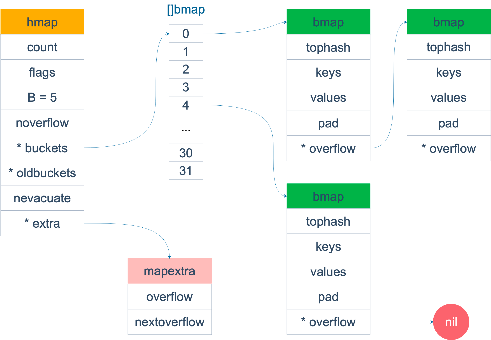
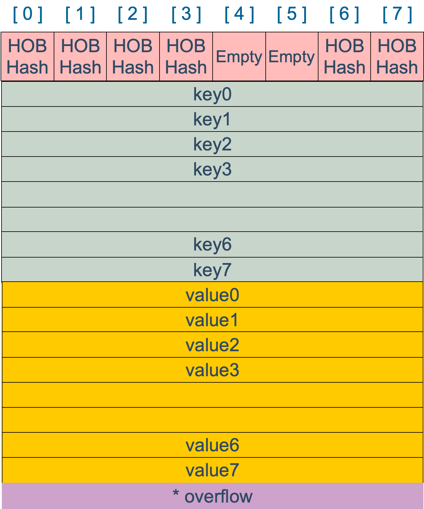

```json
{
  "date": "2021.05.19 13:23",
  "tags": ["golang","map","float"],
  "description":""
}
```

[什么是map](#jump1)

[map的底层实现](#jump2)

&emsp; &emsp; [map内存模型](#jump3)

&emsp; &emsp; [创建map](#jump3)

&emsp; &emsp; [哈希函数](#jump3)

&emsp; &emsp; [key定位过程](#jump3)

# <span id="jump1">什么是map</span>

map 的设计也被称为 “The dictionary problem”，它的任务是设计一种数据结构用来维护一个集合的数据，并且可以同时对集合进行增删查改的操作。
最主要的数据结构有两种：哈希查找表（Hash table）、搜索树（Search tree）。

哈希查找表用一个哈希函数将 key 分配到不同的桶（bucket，也就是数组的不同 index）。这样，开销主要在哈希函数的计算以及数组的常数访问时间。
在很多场景下，哈希查找表的性能很高。 哈希查找表一般会存在“碰撞”的问题，就是说不同的 key 被哈希到了同一个 bucket。一般有两种应对方法：链表法和开放地址法。
链表法将一个 bucket 实现成一个链表，落在同一个 bucket 中的 key 都会插入这个链表。开放地址法则是碰撞发生后，通过一定的规律，在数组的后面挑选“空位”，用来放置新的 key。

搜索树法一般采用自平衡搜索树，包括：AVL 树，红黑树。

自平衡搜索树法的最差搜索效率是 O(logN)，而哈希查找表最差是 O(N)。当然，哈希查找表的平均查找效率是 O(1)，如果哈希函数设计的很好，最坏的情况基本不会出现。
还有一点，遍历自平衡搜索树，返回的 key 序列，一般会按照从小到大的顺序；而哈希查找表则是乱序的。

# <span id="jump2">map的底层实现</span>

GO的版本
```go
go version go1.16.2 darwin/amd64
```

## <span id="jump3">map内存模型</span>
在源码中，表示 map 的结构体是 hmap，它是 hashmap 的“缩写”：
```go
// A header for a Go map.
type hmap struct {
    // Note: the format of the hmap is also encoded in cmd/compile/internal/gc/reflect.go.
    // Make sure this stays in sync with the compiler's definition.
    count     int // # 元素个数，调用 len(map) 时，直接返回此值 Must be first (used by len() builtin)
    flags     uint8
    B         uint8  // buckets 的对数 log_2
    noverflow uint16 // overflow 的 bucket 近似数
    hash0     uint32 // hash seed 计算 key 的哈希的时候会传入哈希函数
    
    buckets    unsafe.Pointer // array of 2^B Buckets. may be nil if count==0.
    oldbuckets unsafe.Pointer // previous bucket array of half the size, non-nil only when growing
    nevacuate  uintptr        // progress counter for evacuation (buckets less than this have been evacuated)
    
    extra *mapextra // optional fields
}
```
说明一下，B 是 buckets 数组的长度的对数，也就是说 buckets 数组的长度就是 2^B。bucket 里面存储了 key 和 value，后面会再讲。

buckets 是一个指针，最终它指向的是一个结构体：
```go
type bmap struct {
    tophash [bucketCnt]uint8
}
```
但这只是表面(src/runtime/hashmap.go)的结构，编译期间会给它加料，动态地创建一个新的结构：
```go
type bmap struct {
    topbits  [8]uint8
    keys     [8]keytype
    values   [8]valuetype
    pad      uintptr
    overflow uintptr
}
```
bmap 就是我们常说的“桶”，桶里面会最多装 8 个 key，这些 key 之所以会落入同一个桶，是因为它们经过哈希计算后，哈希结果是“一类”的。
在桶内，又会根据 key 计算出来的 hash 值的高 8 位来决定 key 到底落入桶内的哪个位置（一个桶内最多有8个位置）。

来一个整体的图：

当 map 的 key 和 value 都不是指针，并且 size 都小于 128 字节的情况下，会把 bmap 标记为不含指针，这样可以避免 gc 时扫描整个 hmap。但是，我们看 bmap 其实有一个 overflow 的字段，是指针类型的，破坏了 bmap 不含指针的设想，这时会把 overflow 移动到 extra 字段来。
```go
type mapextra struct {
    // overflow[0] contains overflow buckets for hmap.buckets.
    // overflow[1] contains overflow buckets for hmap.oldbuckets.
    overflow [2]*[]*bmap
    // nextOverflow 包含空闲的 overflow bucket，这是预分配的 bucket
    nextOverflow *bmap
}
```
bmap 是存放 k-v 的地方，看 bmap 的内部组成。

上图就是 bucket 的内存模型，HOB Hash 指的就是 top hash。 注意到 key 和 value 是各自放在一起的，并不是 key/value/key/value/... 这样的形式。源码里说明这样的好处是在某些情况下可以省略掉 padding 字段，节省内存空间。

例如，有这样一个类型的 map：map[int64]int8

如果按照 key/value/key/value/... 这样的模式存储，那在每一个 key/value 对之后都要额外 padding 7 个字节；而将所有的 key，value 分别绑定到一起，这种形式 key/key/.../value/value/...，则只需要在最后添加 padding。

每个 bucket 设计成最多只能放 8 个 key-value 对，如果有第 9 个 key-value 落入当前的 bucket，那就需要再构建一个 bucket ，通过 overflow 指针连接起来。
## <span id="jump3">创建map</span>

## <span id="jump3">哈希函数</span>

## <span id="jump3">key定位过程</span>


