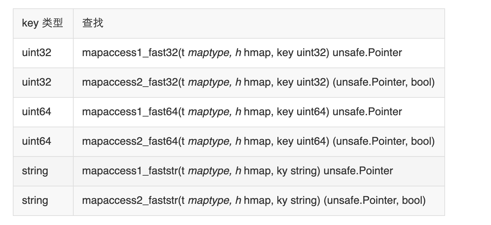

```json
{
  "date": "2021.03.17 18:00",
  "tags": ["go","",""],
  "description":""
}
```
[map 中的 key 为什么是无序的](#jump1)

[map 是线程安全的吗](#jump2)

[map 元素能否取址](#jump3)

[可以边遍历边删除吗](#jump4)

[如何实现两种 get 操作](#jump5)

[如何比较两个 map 相等](#jump6)

## <span id="jump1">map 中的 key 为什么是无序的</span>

map 在扩容后，会发生 key 的搬迁，原来落在同一个 bucket 中的 key，搬迁后，有些 key 就要远走高飞了（bucket 序号加上了 2^B）。而遍历的过程，就是按顺序遍历 bucket，同时按顺序遍历 bucket 中的 key。搬迁后，key 的位置发生了重大的变化，有些 key 飞上高枝，有些 key 则原地不动。这样，遍历 map 的结果就不可能按原来的顺序了。

当然，如果我就一个 hard code 的 map，我也不会向 map 进行插入删除的操作，按理说每次遍历这样的 map 都会返回一个固定顺序的 key/value 序列吧。的确是这样，但是 Go 杜绝了这种做法，因为这样会给新手程序员带来误解，以为这是一定会发生的事情，在某些情况下，可能会酿成大错。

当然，Go 做得更绝，当我们在遍历 map 时，并不是固定地从 0 号 bucket 开始遍历，每次都是从一个随机值序号的 bucket 开始遍历，并且是从这个 bucket 的一个随机序号的 cell 开始遍历。这样，即使你是一个写死的 map，仅仅只是遍历它，也不太可能会返回一个固定序列的 key/value 对了。

多说一句，“迭代 map 的结果是无序的”这个特性是从 go 1.0 开始加入的。

## <span id="jump2">map 是线程安全的吗</span>

map 不是线程安全的。

在查找、赋值、遍历、删除的过程中都会检测写标志，一旦发现写标志置位（等于1），则直接 panic。赋值和删除函数在检测完写标志是复位之后，先将写标志位置位，才会进行之后的操作。

检测写标志：

```go
if h.flags&hashWriting == 0 {
        throw("concurrent map writes")
    }
```
设置写标志：
```go
h.flags |= hashWriting
```

## <span id="jump3">map 元素能否取址</span>
无法对 map 的 key 或 value 进行取址。以下代码不能通过编译：
```go
package main
import "fmt"
func main() {
    m := make(map[string]int)
    fmt.Println(&m["qcrao"])
}
```
编译报错：
```go
./main.go:8:14: cannot take the address of m["qcrao"]
```
如果通过其他 hack 的方式，例如 unsafe.Pointer 等获取到了 key 或 value 的地址，也不能长期持有，因为一旦发生扩容，key 和 value 的位置就会改变，之前保存的地址也就失效了。

## <span id="jump4">可以边遍历边删除吗</span>

map 并不是一个线程安全的数据结构。同时读写一个 map 是未定义的行为，如果被检测到，会直接 panic。

上面说的是发生在多个协程同时读写同一个 map 的情况下。 如果在同一个协程内边遍历边删除，并不会检测到同时读写，理论上是可以这样做的。但是，遍历的结果就可能不会是相同的了，有可能结果遍历结果集中包含了删除的 key，也有可能不包含，这取决于删除 key 的时间：是在遍历到 key 所在的 bucket 时刻前或者后。

一般而言，这可以通过读写锁来解决：sync.RWMutex。

读之前调用 RLock() 函数，读完之后调用 RUnlock() 函数解锁；写之前调用 Lock() 函数，写完之后，调用 Unlock() 解锁。

另外，sync.Map 是线程安全的 map，也可以使用。

## <span id="jump5">如何实现两种 get 操作</span>

Go 语言中读取 map 有两种语法：带 comma 和 不带 comma。当要查询的 key 不在 map 里，带 comma 的用法会返回一个 bool 型变量提示 key 是否在 map 中；而不带 comma 的语句则会返回一个 key 类型的零值。如果 key 是 int 型就会返回 0，如果 key 是 string 类型，就会返回空字符串。
```go
package main
import "fmt"
func main() {
    ageMap := make(map[string]int)
    ageMap["qcrao"] = 18
    // 不带 comma 用法
    age1 := ageMap["stefno"]
    fmt.Println(age1)
    // 带 comma 用法
    age2, ok := ageMap["stefno"]
    fmt.Println(age2, ok)
}
```
运行结果：
```text
0
0 false
```
以前一直觉得好神奇，怎么实现的？这其实是编译器在背后做的工作：分析代码后，将两种语法对应到底层两个不同的函数。
```go
// src/runtime/hashmap.go
func mapaccess1(t *maptype, h *hmap, key unsafe.Pointer) unsafe.Pointer
func mapaccess2(t *maptype, h *hmap, key unsafe.Pointer) (unsafe.Pointer, bool)
```
源码里，函数命名不拘小节，直接带上后缀 1，2，完全不理会《代码大全》里的那一套命名的做法。从上面两个函数的声明也可以看出差别了，mapaccess2 函数返回值多了一个 bool 型变量，两者的代码也是完全一样的，只是在返回值后面多加了一个 false 或者 true。

另外，根据 key 的不同类型，编译器还会将查找、插入、删除的函数用更具体的函数替换，以优化效率：

这些函数的参数类型直接是具体的 uint32、unt64、string，在函数内部由于提前知晓了 key 的类型，所以内存布局是很清楚的，因此能节省很多操作，提高效率。

上面这些函数都是在文件 src/runtime/hashmap_fast.go 里。

## <span id="jump6">如何比较两个 map 相等</span>

map 深度相等的条件：
```text
1、都为 nil
2、非空、长度相等，指向同一个 map 实体对象
3、相应的 key 指向的 value “深度”相等
```
直接将使用 map1 == map2 是错误的。这种写法只能比较 map 是否为 nil。
```go
package main
import "fmt"
func main() {
    var m map[string]int
    var n map[string]int
    fmt.Println(m == nil)
    fmt.Println(n == nil)
    // 不能通过编译
    //fmt.Println(m == n)
}
```
输出结果：
```text
true
true
```
因此只能是遍历map 的每个元素，比较元素是否都是深度相等。
