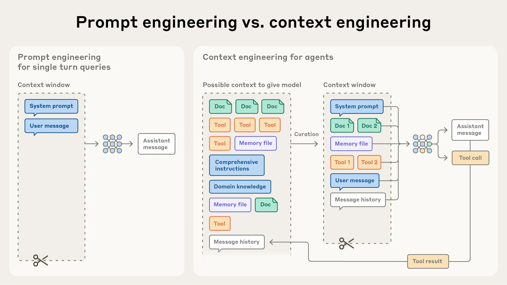

```json
{
  "date": "2026.03.11 22:47",
  "tags": ["ai agent", "context engineering"],
  "description": "上下文工程"
}
```

#### 上下文工程和提示词工程区别

Prompt Engineering 更关心指令怎么写，比如措辞、顺序、格式、语气。

Context Engineering 关心的是这轮调用前，模型窗口里应该放哪些信息，以什么结构放，什么时候放，什么时候撤掉。



#### 上下文工程管理哪些方面

1.System Prompt  
这是静态规则，比如 .cursorrules、.claude/rules、AGENTS.md 这类文件。里面一般会放角色设定、目标、约束、执行流、输出格式。
这些内容决定了 Agent 做任务时的基本边界。

2.User Prompt  
用户输入的业务数据和指令。  
会混着自然语言、业务字段、历史状态、附件内容，处理不好就会污染上下文。

3.Memory  
记忆系统分短期和长期。短期记忆一般是 Session 内的滑动窗口，长期记忆通常是核心事实提取后写入向量数据库，后续按需检索。

4.RAG & Tools  
RAG 负责检索外部文档，把相关内容塞进上下文；Tools 负责把可调用工具的描述、参数格式、调用结果挂载进去。
RAG 可以看作 Context Engineering 的一种实现。它回答的是：检索什么、怎么检索、结果怎么放进上下文。

5.Structured Output  
结构化输出也属于上下文的一部分，比如 JSON Schema、function call 的返回结构。  
它会影响下游系统怎么解析，也会影响后续 Agent 链路怎么衔接。很多人写 Agent 时会忽略这块，最后解析阶段一堆脏活。

6.Token 优化  
摘要压缩、历史剔除、Context Caching 都属于这里，目标很简单：保留信息完整度，同时控制 Token 消耗。

#### context engineering 怎么实现

1.静态规则   
现在比较常见的做法，是用结构化 Markdown 写系统提示词。不要把所有东西揉成一大段，而是拆成角色、目标、约束、执行流、输出格式。  
这些规则可以固化到 .cursorrules 或 AGENTS.md 文件里。

2.动态信息  
上下文窗口不是垃圾桶，很多 Agent 失败不是信息不够，而是塞了太多无关信息。  
动态挂载主要看两块：  
（1）第一块是工具懒加载，也就是 Tool Retrieval。
当 Agent 面对大量 MCP 工具时，把所有工具描述一次性塞进去，既浪费 Token，也会增加误调用概率。
更合理的做法是：先通过向量检索找出当前任务最相关的 Top-5 工具定义，再挂载进去。  
（2）第二块是动态记忆和 RAG。 短期记忆可以用滑动窗口管理，长期事实通过向量数据库检索。API 报错日志、工具返回结果这类 Observation，最好先让 LLM 做一次摘要，只把关键信息写回上下文。原始日志洪流直接塞进去，很容易把模型淹没。

3.Token 不够时要会降级  
低优先级内容可以折叠，比如早期对话历史不一定要保留原文，压缩成摘要就行。中优先级内容可以精简，比如 RAG 检索出来的资料没必要整段保留，可以二次裁剪，只留和当前任务直接相关的片段。高优先级内容不能丢，System Constraints、当前核心工具描述、关键任务目标这些一旦丢了，Agent 很容易开始乱跑。

#### 长任务上下文如何持久化

1. Compaction：窗口快满时压缩历史  
Agent 如果要连续跑几个小时，处理很多轮迭代，只靠普通上下文管理是不够的，它需要跨窗口持久化。
Compaction 就是常见做法：当上下文快满时，把历史内容交给 LLM 总结，然后用摘要开启一个新的上下文窗口继续跑。

2. Structured Note-taking：让 Agent 记笔记
Structured Note-taking 是另一种长任务处理方式。让 Agent 把关键进展写到外部文件里，比如 NOTES.md。上下文重置后，再读取这些笔记继续工作。
这和人类工程师写 to-do list、技术备忘很像。Claude Code 在长任务里会自动维护 to-do list。自定义 Agent 也可以在项目根目录维护 NOTES.md，里面记录当前进度、已知问题、下一步计划。

3. Sub-agent：别让一个 Agent 扛所有状态
Sub-agent 架构的思路很直接：别让一个 Agent 扛完整项目状态。具体来说，就是把专门任务拆给专业化子 Agent，主 Agent 负责分配任务和汇总结果。
每个子 Agent 可以自己探索大量上下文，可能是几万个 Token。但返回给主 Agent 的，只是一段 1000-2000 Token 的高密度摘要。