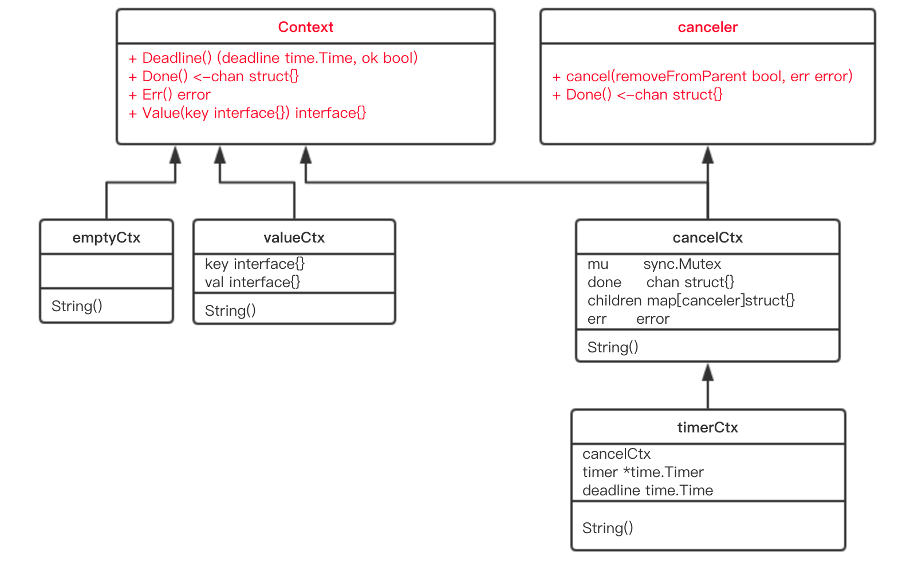
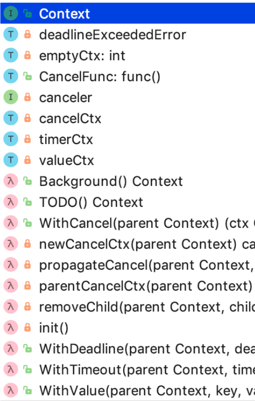

```json
{
  "date": "2021.05.21 15:00",
  "tags": ["go","context",""],
  "description":"Go 1.7 标准库引入 context，中文译作“上下文”，准确说它是 goroutine 的上下文，包含 goroutine 的运行状态、环境、现场等信息。context 主要用来在 goroutine 之间传递上下文信息，包括：取消信号、超时时间、截止时间、k-v 等。随着 context 包的引入，标准库中很多接口因此加上了 context 参数，例如 database/sql 包。context 几乎成为了并发控制和超时控制的标准做法。"
}
```
[一、context源码](#jump1)

&emsp; &emsp; [1.接口](#jump1_1)

&emsp; &emsp; &emsp; &emsp; [Context](#jump1_1_1)

&emsp; &emsp; &emsp; &emsp; [canceler](#jump1_1_2)

&emsp; &emsp; [2.结构体](#jump1_2)

&emsp; &emsp; &emsp; &emsp; [emptyCtx](#jump1_2_1)

&emsp; &emsp; &emsp; &emsp; [cancelCtx](#jump1_2_2)

&emsp; &emsp; &emsp; &emsp; [timerCtx](#jump1_2_3)

[二、context的应用](#jump2)

&emsp; &emsp; [1.传递共享的数据](#jump2_1)

&emsp; &emsp; [2.取消goroutine](#jump2_2)

&emsp; &emsp; [3.防止goroutine泄漏](#jump2_3)

[三、context.Value的查找过程](#jump3)

# <span id="jump1">一、context源码</span>

整体类图

整体图


## <span id="jump1_1">1.接口</span>

### <span id="jump1_1_1">Context</span>
```go
type Context interface {
    // 当 context 被取消或者到了 deadline，返回一个被关闭的 channel
    Done() <-chan struct{}
    // 在 channel Done 关闭后，返回 context 取消原因
    Err() error
    // 返回 context 是否会被取消以及自动取消时间（即 deadline）
    Deadline() (deadline time.Time, ok bool)
    // 获取 key 对应的 value
    Value(key interface{}) interface{}
}
```
Context 是一个接口，定义了 4 个方法，它们都是幂等的。也就是说连续多次调用同一个方法，得到的结果都是相同的。

Done() 返回一个 channel，可以表示 context 被取消的信号：当这个 channel 被关闭时，说明 context 被取消了。注意，这是一个只读的channel。 我们又知道，读一个关闭的 channel 会读出相应类型的零值。并且源码里没有地方会向这个 channel 里面塞入值。换句话说，这是一个 receive-only 的 channel。因此在子协程里读这个 channel，除非被关闭，否则读不出来任何东西。也正是利用了这一点，子协程从 channel 里读出了值（零值）后，就可以做一些收尾工作，尽快退出。

Err() 返回一个错误，表示 channel 被关闭的原因。例如是被取消，还是超时。

Deadline() 返回 context 的截止时间，通过此时间，函数就可以决定是否进行接下来的操作，如果时间太短，就可以不往下做了，否则浪费系统资源。当然，也可以用这个 deadline 来设置一个 I/O 操作的超时时间。

Value() 获取之前设置的 key 对应的 value。

### <span id="jump1_1_2">canceler</span>

```go
type canceler interface {
    cancel(removeFromParent bool, err error)
    Done() <-chan struct{}
}
```
实现了上面定义的两个方法的 Context，就表明该 Context 是可取消的。源码中有两个类型实现了 canceler 接口：*cancelCtx 和 *timerCtx。注意是加了 * 号的，是这两个结构体的指针实现了 canceler 接口。

Context 接口设计成这个样子的原因：

- “取消”操作应该是建议性，而非强制性

caller 不应该去关心、干涉 callee 的情况，决定如何以及何时 return 是 callee 的责任。caller 只需发送“取消”信息，callee 根据收到的信息来做进一步的决策，因此接口并没有定义 cancel 方法。

- “取消”操作应该可传递

“取消”某个函数时，和它相关联的其他函数也应该“取消”。因此，Done() 方法返回一个只读的 channel，所有相关函数监听此 channel。一旦 channel 关闭，通过 channel 的“广播机制”，所有监听者都能收到。

## <span id="jump1_2">2.结构体</span>

### <span id="jump1_2_1">emptyCtx</span>

### <span id="jump1_2_2">cancelCtx</span>

### <span id="jump1_2_3">timerCtx</span>

# <span id="jump2">二、context的应用</span>

## <span id="jump2_1">1.传递共享的数据</span>

## <span id="jump2_2">2.取消goroutine</span>

## <span id="jump2_3">3.防止goroutine泄漏</span>

# <span id="jump3">三、context.Value的查找过程</span>
