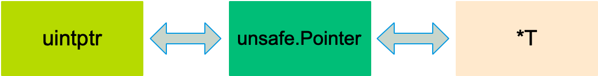

```json
{
  "date": "2021.05.21 15:00",
  "tags": ["go","context",""],
  "description":"Go 语言的作者之一 Ken Thompson 也是 C 语言的作者。所以，Go 可以看作 C 系语言，它的很多特性都和 C 类似，指针就是其中之一。然而，Go 语言的指针相比 C 的指针有很多限制。这当然是为了安全考虑，要知道像 Java/Python 这些现代语言，生怕程序员出错，哪有什么指针（这里指的是显式的指针）？更别说像 C/C++ 还需要程序员自己清理“垃圾”。所以对于 Go 来说，有指针已经很不错了，仅管它有很多限制。"
}
```

[go指针和unsafe.Pointer有什么区别](#jump1)

[如何利用unsafe包修改私有成员](#jump2)

[如何利用unsafe获取slice&map的长度](#jump3)

[如何实现字符串和byte切片的零拷贝转换](#jump4)

# <span id="jump1">go指针和unsafe.Pointer有什么区别</span>

相比于 C 语言中指针的灵活，Go 的指针多了一些限制。

限制一：Go 的指针不能进行数学运算。

来看一个简单的例子：
```go
a := 5
p := &a
p++
p = &a + 3
```
上面的代码将不能通过编译，会报编译错误：invalid operation，也就是说不能对指针做数学运算。

限制二：不同类型的指针不能相互转换。

例如下面这个简短的例子：
```go
func main() {
    a := int(100)
    var f *float64
    f = &a
}
```
限制三：不同类型的指针不能使用 == 或 != 比较。

只有在两个指针类型相同或者可以相互转换的情况下，才可以对两者进行比较。另外，指针可以通过 == 和 != 直接和 nil 作比较。

限制四：不同类型的指针变量不能相互赋值。

这一点同限制三。

unsafe.Pointer 在 unsafe 包：
```go
type ArbitraryType int
type Pointer *ArbitraryType
```
从命名来看，Arbitrary 是任意的意思，也就是说 Pointer 可以指向任意类型，实际上它类似于 C 语言里的 void*。

unsafe 包提供了 2 点重要的能力：
```text
任何类型的指针和 unsafe.Pointer 可以相互转换。
uintptr 类型和 unsafe.Pointer 可以相互转换。
```

pointer 不能直接进行数学运算，但可以把它转换成 uintptr，对 uintptr 类型进行数学运算，再转换成 pointer 类型。

```go
// uintptr 是一个整数类型，它足够大，可以存储
type uintptr uintptr
```
还有一点要注意的是，uintptr 并没有指针的语义，意思就是 uintptr 所指向的对象会被 gc 无情地回收。而 unsafe.Pointer 有指针语义，可以保护它所指向的对象在“有用”的时候不会被垃圾回收。

unsafe 包中的几个函数都是在编译期间执行完毕，毕竟，编译器对内存分配这些操作“了然于胸”。在 /go/src/cmd/compile/internal/gc/unsafe.go 路径下，可以看到编译期间 Go 对 unsafe 包中函数的处理。

# <span id="jump2">如何利用unsafe包修改私有成员</span>

对于一个结构体，通过 offset 函数可以获取结构体成员的偏移量，进而获取成员的地址，读写该地址的内存，就可以达到改变成员值的目的。

这里有一个内存分配相关的事实：结构体会被分配一块连续的内存，结构体的地址也代表了第一个成员的地址。

我们来看一个例子：
```go
package main
import (
    "fmt"
    "unsafe"
)
type Programmer struct {
    name string
    language string
}
func main() {
    p := Programmer{"stefno", "go"}
    fmt.Println(p)
    name := (*string)(unsafe.Pointer(&p))
    *name = "qcrao"
    lang := (*string)(unsafe.Pointer(uintptr(unsafe.Pointer(&p)) + unsafe.Offsetof(p.language)))
    *lang = "Golang"
    fmt.Println(p)
}
```
运行代码，输出：
```go
{stefno go}
{qcrao Golang}
```
name 是结构体的第一个成员，因此可以直接将 &p 解析成 *string。这一点，在前面获取 map 的 count 成员时，用的是同样的原理。

对于结构体的私有成员，现在有办法可以通过 unsafe.Pointer 改变它的值了。

我把 Programmer 结构体升级，多加一个字段：
```go
type Programmer struct {
    name string
    age int
    language string
}
```
并且放在其他包，这样在 main 函数中，它的三个字段都是私有成员变量，不能直接修改。但我通过 unsafe.Sizeof() 函数可以获取成员大小，进而计算出成员的地址，直接修改内存。
```go
func main() {
    p := Programmer{"stefno", 18, "go"}
    fmt.Println(p)
    lang := (*string)(unsafe.Pointer(uintptr(unsafe.Pointer(&p)) + unsafe.Sizeof(int(0)) + unsafe.Sizeof(string(""))))
    *lang = "Golang"
    fmt.Println(p)
}
```
输出：
```go
{stefno 18 go}
{stefno 18 Golang}
```

# <span id="jump3">如何利用unsafe获取slice&map的长度</span>

## 获取 slice 长度
slice header 的结构体定义：
```go
// runtime/slice.go
type slice struct {
    array unsafe.Pointer // 元素指针
    len   int // 长度 
    cap   int // 容量
}
```
调用 make 函数新建一个 slice，底层调用的是 makeslice 函数，返回的是 slice 结构体：
```go
func makeslice(et *_type, len, cap int) slice
```
因此我们可以通过 unsafe.Pointer 和 uintptr 进行转换，得到 slice 的字段值。
```go
func main() {
    s := make([]int, 9, 20)
    var Len = *(*int)(unsafe.Pointer(uintptr(unsafe.Pointer(&s)) + uintptr(8)))
    fmt.Println(Len, len(s)) // 9 9
    var Cap = *(*int)(unsafe.Pointer(uintptr(unsafe.Pointer(&s)) + uintptr(16)))
    fmt.Println(Cap, cap(s)) // 20 20
}
```
Len，cap 的转换流程如下：
```go
Len: &s => pointer => uintptr => pointer => *int => int
Cap: &s => pointer => uintptr => pointer => *int => int
```

## 获取 map 长度
map：
```go
type hmap struct {
    count     int
    flags     uint8
    B         uint8
    noverflow uint16
    hash0     uint32
    buckets    unsafe.Pointer
    oldbuckets unsafe.Pointer
    nevacuate  uintptr
    extra *mapextra
}
```
和 slice 不同的是，makemap 函数返回的是 hmap 的指针，注意是指针：
```go
func makemap(t *maptype, hint int64, h *hmap, bucket unsafe.Pointer) *hmap
```
我们依然能通过 unsafe.Pointer 和 uintptr 进行转换，得到 hamp 字段的值，只不过，现在 count 变成二级指针了：
```go
func main() {
    mp := make(map[string]int)
    mp["qcrao"] = 100
    mp["stefno"] = 18
    count := **(**int)(unsafe.Pointer(&mp))
    fmt.Println(count, len(mp)) // 2 2
}
```
count 的转换过程：
```go
&mp => pointer => **int => int
```

# <span id="jump4">如何实现字符串和byte切片的零拷贝转换</span>

这是一个非常精典的例子。实现字符串和 bytes 切片之间的转换，要求是 zero-copy。想一下，一般的做法，都需要遍历字符串或 bytes 切片，再挨个赋值。

完成这个任务，我们需要了解 slice 和 string 的底层数据结构：
```go
type StringHeader struct {
    Data uintptr
    Len  int
}
type SliceHeader struct {
    Data uintptr
    Len  int
    Cap  int
}
```
上面是反射包下的结构体，路径：src/reflect/value.go。只需要共享底层 []byte 数组就可以实现 zero-copy。
```go
func string2bytes(s string) []byte {
    stringHeader := (*reflect.StringHeader)(unsafe.Pointer(&s))
    bh := reflect.SliceHeader{
        Data: stringHeader.Data,
        Len:  stringHeader.Len,
        Cap:  stringHeader.Len,
    }
    return *(*[]byte)(unsafe.Pointer(&bh))
}
func bytes2string(b []byte) string{
    sliceHeader := (*reflect.SliceHeader)(unsafe.Pointer(&b))
    sh := reflect.StringHeader{
        Data: sliceHeader.Data,
        Len:  sliceHeader.Len,
    }
    return *(*string)(unsafe.Pointer(&sh))
}
```
代码比较简单，不作详细解释。通过构造 slice header 和 string header，来完成 string 和 byte slice 之间的转换。
