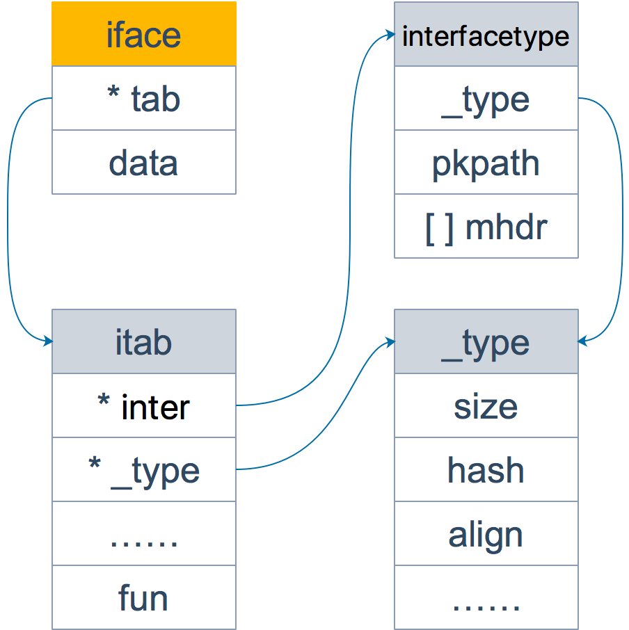
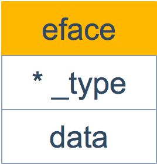

```json
{
  "date": "2021.05.25 21:17",
  "tags": ["go","interface",""],
  "description":"Go 语言的作者之一 Ken Thompson 也是 C 语言的作者。所以，Go 可以看作 C 系语言，它的很多特性都和 C 类似，指针就是其中之一。然而，Go 语言的指针相比 C 的指针有很多限制。这当然是为了安全考虑，要知道像 Java/Python 这些现代语言，生怕程序员出错，哪有什么指针（这里指的是显式的指针）？更别说像 C/C++ 还需要程序员自己清理“垃圾”。所以对于 Go 来说，有指针已经很不错了，仅管它有很多限制。"
}
```

[iface和eface的区别是什么](#jump1)

[值接收者和指针接收者](#jump2)

&emsp; &emsp; &emsp; &emsp; [方法](#jump2_1)

&emsp; &emsp; &emsp; &emsp; [值接收者和指针接收者](#jump2_2)

&emsp; &emsp; &emsp; &emsp; [两者分别在何时使用](#jump2_3)

# <span id="jump1">iface 和 eface 的区别是什么</span>

iface 和 eface 都是 Go 中描述接口的底层结构体，区别在于 iface 描述的接口包含方法，而 eface 则是不包含任何方法的空接口：interface{}。

从源码层面看一下：

```go
type iface struct {
    tab  *itab
    data unsafe.Pointer
}
type itab struct {
    inter  *interfacetype
    _type  *_type
    link   *itab
    hash   uint32 // copy of _type.hash. Used for type switches.
    bad    bool   // type does not implement interface
    inhash bool   // has this itab been added to hash?
    unused [2]byte
    fun    [1]uintptr // variable sized
}
```

iface 内部维护两个指针，tab 指向一个 itab 实体， 它表示接口的类型以及赋给这个接口的实体类型。data 则指向接口具体的值，一般而言是一个指向堆内存的指针。

再来仔细看一下 itab 结构体：_type 字段描述了实体的类型，包括内存对齐方式，大小等；inter 字段则描述了接口的类型。fun 字段放置和接口方法对应的具体数据类型的方法地址，实现接口调用方法的动态分派，一般在每次给接口赋值发生转换时会更新此表，或者直接拿缓存的 itab。

这里只会列出实体类型和接口相关的方法，实体类型的其他方法并不会出现在这里。如果你学过 C++ 的话，这里可以类比虚函数的概念。

另外，你可能会觉得奇怪，为什么 fun 数组的大小为 1，要是接口定义了多个方法可怎么办？实际上，这里存储的是第一个方法的函数指针，如果有更多的方法，在它之后的内存空间里继续存储。从汇编角度来看，通过增加地址就能获取到这些函数指针，没什么影响。顺便提一句，这些方法是按照函数名称的字典序进行排列的。

再看一下 interfacetype 类型，它描述的是接口的类型：

```go
type interfacetype struct {
    typ     _type
    pkgpath name
    mhdr    []imethod
}
```

可以看到，它包装了 _type 类型，_type 实际上是描述 Go 语言中各种数据类型的结构体。我们注意到，这里还包含一个 mhdr 字段，表示接口所定义的函数列表， pkgpath 记录定义了接口的包名。

这里通过一张图来看下 iface 结构体的全貌：



接着来看一下 eface 的源码：

```go
type eface struct {
    _type *_type
    data  unsafe.Pointer
}
```

相比 iface，eface 就比较简单了。只维护了一个 _type 字段，表示空接口所承载的具体的实体类型。data 描述了具体的值。



我们来看个例子：

```go
package main
import "fmt"
func main() {
    x := 200
    var any interface{} = x
    fmt.Println(any)
    g := Gopher{"Go"}
    var c coder = g
    fmt.Println(c)
}
type coder interface {
    code()
    debug()
}
type Gopher struct {
    language string
}
func (p Gopher) code() {
    fmt.Printf("I am coding %s language\n", p.language)
}
func (p Gopher) debug() {
    fmt.Printf("I am debuging %s language\n", p.language)
}
```

执行命令，打印出汇编语言：

```go
go tool compile -S ./src/main.go
```

可以看到，main 函数里调用了两个函数：

```go
func convT2E64(t *_type, elem unsafe.Pointer) (e eface)
func convT2I(tab *itab, elem unsafe.Pointer) (i iface)
```

上面两个函数的参数和 iface 及 eface 结构体的字段是可以联系起来的：两个函数都是将参数组装一下，形成最终的接口。

作为补充，我们最后再来看下 _type 结构体：

```go
type _type struct {
    // 类型大小
    size       uintptr
    ptrdata    uintptr
    // 类型的 hash 值
    hash       uint32
    // 类型的 flag，和反射相关
    tflag      tflag
    // 内存对齐相关
    align      uint8
    fieldalign uint8
    // 类型的编号，有bool, slice, struct 等等等等
    kind       uint8
    alg        *typeAlg
    // gc 相关
    gcdata    *byte
    str       nameOff
    ptrToThis typeOff
}
```

Go 语言各种数据类型都是在 _type 字段的基础上，增加一些额外的字段来进行管理的：

```go
type arraytype struct {
    typ   _type
    elem  *_type
    slice *_type
    len   uintptr
}
type chantype struct {
    typ  _type
    elem *_type
    dir  uintptr
}
type slicetype struct {
    typ  _type
    elem *_type
}
type structtype struct {
    typ     _type
    pkgPath name
    fields  []structfield
}
```

这些数据类型的结构体定义，是反射实现的基础。

# <span id="jump2">值接收者和指针接收者</span>

## <span id="jump2_1">方法</span>

方法能给用户自定义的类型添加新的行为。它和函数的区别在于方法有一个接收者，给一个函数添加一个接收者，那么它就变成了方法。接收者可以是值接收者，也可以是指针接收者。

在调用方法的时候，值类型既可以调用值接收者的方法，也可以调用指针接收者的方法；指针类型既可以调用指针接收者的方法，也可以调用值接收者的方法。

也就是说，不管方法的接收者是什么类型，该类型的值和指针都可以调用，不必严格符合接收者的类型。

来看个例子：

```go
package main
import "fmt"
type Person struct {
    age int
}
func (p Person) howOld() int {
    return p.age
}
func (p *Person) growUp() {
    p.age += 1
}
func main() {
    // qcrao 是值类型
    qcrao := Person{age: 18}
    // 值类型 调用接收者也是值类型的方法
    fmt.Println(qcrao.howOld())
    // 值类型 调用接收者是指针类型的方法
    qcrao.growUp()
    fmt.Println(qcrao.howOld())
    // ----------------------
    // stefno 是指针类型
    stefno := &Person{age: 100}
    // 指针类型 调用接收者是值类型的方法
    fmt.Println(stefno.howOld())
    // 指针类型 调用接收者也是指针类型的方法
    stefno.growUp()
    fmt.Println(stefno.howOld())
}
```

上例子的输出结果是：

```go
18
19
100
101
```

调用了 growUp 函数后，不管调用者是值类型还是指针类型，它的 Age 值都改变了。

实际上，当类型和方法的接收者类型不同时，其实是编译器在背后做了一些工作，用一个表格来呈现：

|  | 值接收者 | 指针接收者 |
| :-----| :---- | :---- |
| 值类型调用者 | 方法会使用调用者的一个副本，类似于“传值” | 使用值的引用来调用方法，上例中，qcrao.growUp() 实际上是 (&qcrao).growUp() |
| 指针类型调用者 | 指针被解引用为值，上例中，stefno.howOld() 实际上是 (*stefno).howOld() | 实际上也是“传值”，方法里的操作会影响到调用者，类似于指针传参，拷贝了一份指针 |

## <span id="jump2_2">值接收者和指针接收者</span>

前面说过，不管接收者类型是值类型还是指针类型，都可以通过值类型或指针类型调用，这里面实际上通过语法糖起作用的。

先说结论：实现了接收者是值类型的方法，相当于自动实现了接收者是指针类型的方法；而实现了接收者是指针类型的方法，不会自动生成对应接收者是值类型的方法。

来看一个例子，就会完全明白：

```go
package main
import "fmt"
type coder interface {
    code()
    debug()
}
type Gopher struct {
    language string
}
func (p Gopher) code() {
    fmt.Printf("I am coding %s language\n", p.language)
}
func (p *Gopher) debug() {
    fmt.Printf("I am debuging %s language\n", p.language)
}
func main() {
    var c coder = &Gopher{"Go"}
    c.code()
    c.debug()
}
```

上述代码里定义了一个接口 coder，接口定义了两个函数：

```go
code()
debug()
```

接着定义了一个结构体 Gopher，它实现了两个方法，一个值接收者，一个指针接收者。

最后，我们在 main 函数里通过接口类型的变量调用了定义的两个函数。

运行一下，结果：

```go
I am coding Go language
I am debuging Go language
```

但是如果我们把 main 函数的第一条语句换一下：

```go
func main() {
    var c coder = Gopher{"Go"}
    c.code()
    c.debug()
}
```

运行一下，报错：

```go
src/main.go:23:6: cannot use Gopher literal (type Gopher) as type coder in assignment:
    Gopher does not implement coder (debug method has pointer receiver)
```

看出这两处代码的差别了吗？第一次是将 &Gopher 赋给了 coder；第二次则是将 Gopher 赋给了 coder。

第二次报错是说，Gopher 没有实现 coder。很明显了吧，因为 Gopher 类型并没有实现 debug 方法；表面上看， *Gopher 类型也没有实现 code 方法，但是因为 Gopher 类型实现了 code 方法，所以让 *Gopher 类型自动拥有了 code 方法。

当然，上面的说法有一个简单的解释：接收者是指针类型的方法，很可能在方法中会对接收者的属性进行更改操作，从而影响接收者；而对于接收者是值类型的方法，在方法中不会对接收者本身产生影响。

所以，当实现了一个接收者是值类型的方法，就可以自动生成一个接收者是对应指针类型的方法，因为两者都不会影响接收者。但是，当实现了一个接收者是指针类型的方法，如果此时自动生成一个接收者是值类型的方法，原本期望对接收者的改变（通过指针实现），现在无法实现，因为值类型会产生一个拷贝，不会真正影响调用者。

最后，只要记住下面这点就可以了：

```text
如果实现了接收者是值类型的方法，会隐含地也实现了接收者是指针类型的方法。
```

## <span id="jump2_3">两者分别在何时使用</span>

如果方法的接收者是值类型，无论调用者是对象还是对象指针，修改的都是对象的副本，不影响调用者；如果方法的接收者是指针类型，则调用者修改的是指针指向的对象本身。

使用指针作为方法的接收者的理由：

- 方法能够修改接收者指向的值。

- 避免在每次调用方法时复制该值，在值的类型为大型结构体时，这样做会更加高效。

是使用值接收者还是指针接收者，不是由该方法是否修改了调用者（也就是接收者）来决定，而是应该基于该类型的本质。

如果类型具备“原始的本质”，也就是说它的成员都是由 Go 语言里内置的原始类型，如字符串，整型值等，那就定义值接收者类型的方法。像内置的引用类型，如 slice，map，interface，channel，这些类型比较特殊，声明他们的时候，实际上是创建了一个 header， 对于他们也是直接定义值接收者类型的方法。这样，调用函数时，是直接 copy 了这些类型的 header，而 header 本身就是为复制设计的。

如果类型具备非原始的本质，不能被安全地复制，这种类型总是应该被共享，那就定义指针接收者的方法。比如 go 源码里的文件结构体（struct File）就不应该被复制，应该只有一份实体。