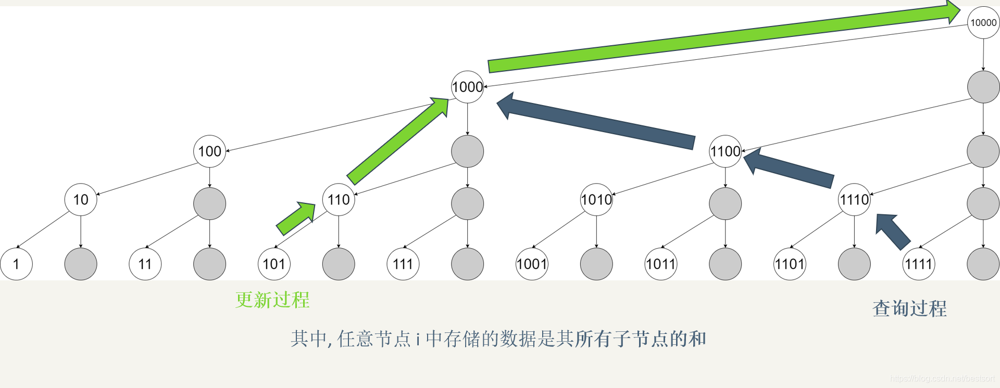
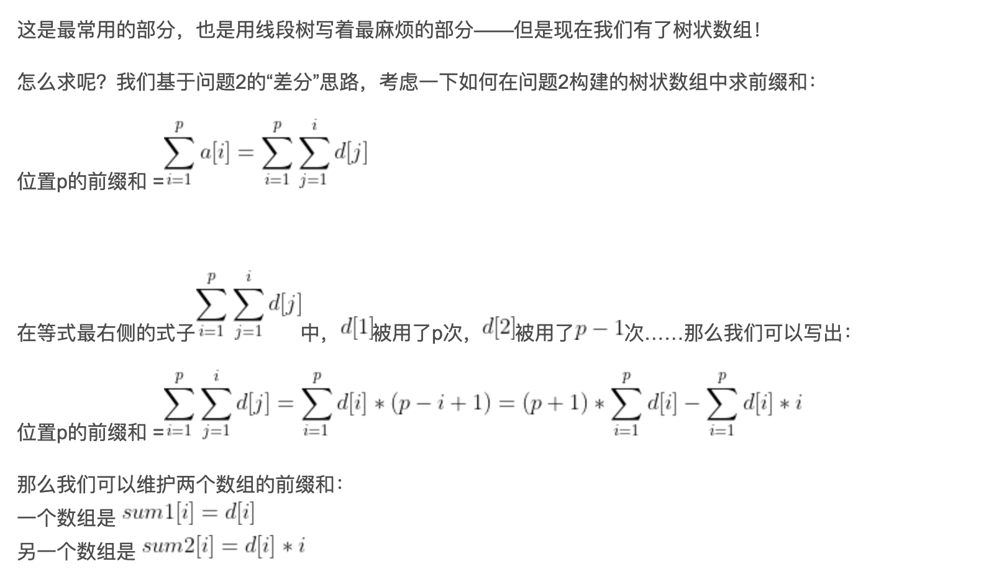

```json
{  
    "date": "2021.05.20 14:08", 
    "tags": ["java",""], 
    "description":"树状数组"
}
```
[树状数组(单点更新+区间查询)](#jump1)

[一些应用](#jump2)

&emsp; &emsp; [区间更新+单点查询](#jump3)

&emsp; &emsp; [区间更新+区间查询](#jump4)

&emsp; &emsp; [求区间最大值](#jump5)

&emsp; &emsp; [二维树状数组](#jump6)

&emsp; &emsp; &emsp; &emsp; [单点更新+区间查询](#jump7)

&emsp; &emsp; &emsp; &emsp; [区间更新+单点查询](#jump8)

&emsp; &emsp; &emsp; &emsp; [区间更新+区间查询](#jump9)

# <span id="jump1">树状数组(单点更新+区间查询)</span>

和线段树的具体区别和联系如下：

1.两者在复杂度上同级, 但是树状数组的常数明显优于线段树, 其编程复杂度也远小于线段树.

2.树状数组的作用被线段树完全涵盖, 凡是可以使用树状数组解决的问题, 使用线段树一定可以解决, 但是线段树能够解决的问题树状数组未必能够解决.

3.树状数组的突出特点是其编程的极端简洁性, 使用lowbit技术可以在很短的几步操作中完成树状数组的核心操作，其代码效率远高于线段树。

更新过程是每次加了个二进制的低位1(101+1 ->110, 110 + 10 -> 1000, 1000 + 1000 -> 10000)

查询过程每次就是去掉了二进制中的低位1(1111 - 1 -> 1110, 1110 - 10 -> 1100, 1100 - 100 -> 1000)



```java
class NumArray {
    int[] tree;
    int lowbit(int x) {
        return x & -x;
    }
    int query(int x) {
        int ans = 0;
        for (int i = x; i > 0; i -= lowbit(i)) ans += tree[i];
        return ans;
    }
    void add(int x, int u) {
        for (int i = x; i <= n; i += lowbit(i)) tree[i] += u;
    }
    //以上为模板

    int[] nums;
    int n;
    public NumArray(int[] _nums) {
        nums = _nums;
        n = nums.length;
        tree = new int[n + 1];
        for (int i = 0; i < n; i++) add(i + 1, nums[i]);
    }
    
    public void update(int i, int val) {
        add(i + 1, val - nums[i]);
        nums[i] = val;
    }
    
    public int sumRange(int l, int r) {
        return query(r + 1) - query(l);
    }
}
```
# <span id="jump2">一些应用</span>

## <span id="jump3">区间更新+单点查询</span>
通过“差分”（就是记录数组中每个元素与前一个元素的差），可以把这个问题转化为单点更新。

### 查询
设原数组为a, 设数组d[i]=a[i]-a[i-1], 则a[i] = d[1]+d[2]+...+d[i], 可以通过求d[i]的前缀和查询
### 修改
当给区间[l,r]加上u的时候, a[l]与前一个元素a[l-1]的差增加了u, a[r+1]与a[r]的差减少了u
```java
void add(int x, int u){ //这个函数用来在树状数组中直接修改
    while(x <= n){
        sum[x] += u;
        x += x & -x;
    }
}
void range_add(int l, int r, int u){ //给区间[l, r]加上x
    add(l, u);
    add(r + 1, -u);
}
int ask(int x){ //单点查询
    int res = 0;
    while(x>0){
        res += sum[x];
        x -= x & -x;
    }
    return res;
}
```

## <span id="jump4">区间更新+区间查询</span>


### 查询
位置p的前缀和即：(p+1)*sum1数组中p的前缀和 - sum2数组中p的前缀和。

区间[l, r]的和即：位置r的前缀和 - 位置l的前缀和。

### 修改
对于sum1数组的修改同问题2中对d数组的修改。

对于sum2数组的修改也类似，我们给 sum2[l] 加上 l * x，给 sum2[r + 1] 减去 (r + 1) * x。
```c++
void add(ll p, ll x){
    for(int i = p; i <= n; i += i & -i)
        sum1[i] += x, sum2[i] += x * p;
}
void range_add(ll l, ll r, ll x){
    add(l, x), add(r + 1, -x);
}
ll ask(ll p){
    ll res = 0;
    for(int i = p; i; i -= i & -i)
        res += (p + 1) * sum1[i] - sum2[i];
    return res;
}
```
用这个做区间修改区间求和的题，无论是时间上还是空间上都比带lazy标记的线段树要优。

## <span id="jump5">求区间最大值</span>
```java
void update(int x,int u){
    while(x<=n){
        t[x] = max(t[x],u);
        x += lowbit(x);
    }
}
```
```java

int query(int x){
    int ans = 0;
    while(x>0){
        ans = max(ans,t[x]);
        x -= lowbit(x);
    }
    return ans;
}
```

## <span id="jump6">二维树状数组</span>

在一维树状数组中，tree[x]（树状数组中的那个“数组”）记录的是右端点为x、长度为lowbit(x)的区间的区间和。
那么在二维树状数组中，可以类似地定义tree[x][y]记录的是右下角为(x, y)，高为lowbit(x), 宽为 lowbit(y)的区间的区间和。

### <span id="jump7">单点更新+区间查询</span>

```java
class NumMatrix {

    int[][] tree;
    int lowbit(int x) {
        return x & -x;
    }
    public void add(int row, int col, int val) {
        int memo_y = col;
        while(row <= m){
            col = memo_y;
            while(col <= n){
                tree[row][col] += val;
                col += lowbit(col);
            }
        
            row += lowbit(row);
        }
    }
    public int query(int x, int y) {
        int res = 0, memo_y = y;
        while(x>0){
            y = memo_y;
            while(y>0){
                res += tree[x][y];
                y -= y & -y;
            }
            x -= x & -x;
        }
        return res;
    }
    
    int[][] matrix;
    int m,n;
    public NumMatrix(int[][] matrix) {
        this.matrix = matrix;
        m = matrix.length;
        n = matrix[0].length;
        tree = new int[m+1][n+1];
        for(int i=0;i<m;i++){
            for(int j=0;j<n;j++){
                add(i+1,j+1,matrix[i][j]);
            }
        }
    }
    
    public void update(int row, int col, int val) {
        add(row+1, col+1, val-matrix[row][col]);
        matrix[row][col] = val;
    }
    
    public int sumRegion(int row1, int col1, int row2, int col2) {
        return query(row2+1, col2+1)-query(row1, col2+1)-query(row2+1, col1)+query(row1,col1);
    }
    
}
```

### <span id="jump8">区间更新+单点查询</span>

### <span id="jump9">区间更新+区间查询</span>